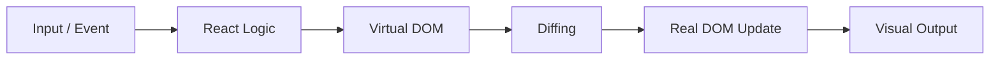

# Setup Your First Project

Language: English

## What is it?
Vite is a fast tool to start modern React apps.

## Why do we need it?
You need quick setup to focus on learning React, not build configs.

## Real-life analogy
Like moving into a ready kitchen before cooking.

## How does it work?
- Install Node.js.
- Run npm create vite@latest.
- Choose React template.
- npm install and npm run dev.

## Diagram

## Code Example
### Wrong Way
```jsx
import { useState } from "react"; // import hook

const Demo = () => { // component
  let count = 0; // plain variable

  const handleClick = () => { // click handler
    count = count + 1; // React will not track this change reliably
    console.log("Wrong count:", count); // debug output
  }; // end handler

  return <button onClick={handleClick}>Count: {count}</button>; // UI
}; // end component

export default Demo; // export
```
### Right Way
```jsx
import { useState } from "react"; // import hook

const Demo = () => { // component
  const [count, setCount] = useState(0); // state

  const handleClick = () => { // click handler
    setCount((prev) => prev + 1); // safe update
    console.log("Count will update on next render"); // debug output
  }; // end handler

  return ( // return UI
    <section> {/* wrapper */}
      <h2>Counter Demo</h2> {/* title */}
      <p>Current count: {count}</p> {/* visual output */}
      <button onClick={handleClick}>Increase</button> {/* action */}
    </section> // end wrapper
  ); // end return
}; // end component

export default Demo; // export
```
## Common Mistakes
Using outdated CRA tutorials for new apps.

## Best Practices
Use Vite for new React projects.

## When to use it?
Use whenever starting a new project.

## Related concepts
- [04-jsx-explained.md](04-jsx-explained.md)

## Pro Tip
Build the smallest possible example first. Then add one small improvement.

## Watch Out
Don't panic! If this feels hard, run the sample and read logs one line at a time.

## Quick Revision
- This concept solves a real React problem.
- We compared wrong and right approaches.
- The sample is copy-paste ready.
- Visual output and logs confirm behavior.
- Small components are easier to maintain.

## Interview Questions
1. What problem does this concept solve?
Answer: It improves structure, predictability, and UI reliability.
2. What is one beginner mistake here?
Answer: Mixing concerns and not following React flow.
3. When should you avoid overusing this concept?
Answer: When a simpler approach already solves the problem.
4. How do you verify it works?
Answer: Check browser output and console.log behavior.


