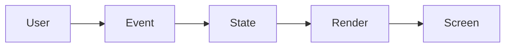

# 02-weather-app


Language: English

## What is it?
This is a full project walkthrough. We build a real app and connect many React concepts together.

## Why do we need it?
Projects help us move from theory to real-world skills. This is where confidence grows.

## Real-life analogy
Learning projects are like driving practice after passing a theory exam.

## How does it work?
- Define UI goal and features.
- Split app into small components.
- Manage local/shared state.
- Handle API or user interactions.
- Test key user paths.

## What you'll build
A practical app with user interactions, state updates, and visible output.

## Concepts practiced
- Components and props
- Local state and hooks
- Conditional rendering
- Data flow and event handling

## Folder structure
```txt
src/
  components/
  hooks/
  pages/
  App.jsx
```
## Code Example
### Wrong Way
```jsx
import { useState } from "react"; // import hook

const Demo = () => { // component
  let count = 0; // plain variable

  const handleClick = () => { // click handler
    count = count + 1; // React will not track this change reliably
    console.log("Wrong count:", count); // debug output
  }; // end handler

  return <button onClick={handleClick}>Count: {count}</button>; // UI
}; // end component

export default Demo; // export
```
### Right Way
```jsx
import { useState } from "react"; // import hook

const Demo = () => { // component
  const [count, setCount] = useState(0); // state

  const handleClick = () => { // click handler
    setCount((prev) => prev + 1); // safe update
    console.log("Count will update on next render"); // debug output
  }; // end handler

  return ( // return UI
    <section> {/* wrapper */}
      <h2>Counter Demo</h2> {/* title */}
      <p>Current count: {count}</p> {/* visual output */}
      <button onClick={handleClick}>Increase</button> {/* action */}
    </section> // end wrapper
  ); // end return
}; // end component

export default Demo; // export
```
## Diagram

## Common Mistakes
- One giant component for everything.
- No loading/error states.
- No separation of UI and logic.

## Best Practices
- Keep components single-purpose.
- Create reusable hooks for repeated logic.
- Add small tests for critical interactions.

## When to use it?
Use project patterns in portfolio apps and interview take-home assignments.

## Related concepts
- [../03-hooks/02-useState.md](../03-hooks/02-useState.md)
- [../05-routing/02-react-router-setup.md](../05-routing/02-react-router-setup.md)

## How to extend it further
- Add authentication
- Add pagination or filtering
- Add tests and performance checks

## Quick Revision
- We built a real project structure.
- We used modern React patterns.
- We compared wrong and right setup.
- We kept code modular and scalable.
- We planned extension ideas.

## Interview Questions
1. Why split project into components?
Answer: Better reuse, maintainability, and testing.
2. How would you scale this app?
Answer: Add routing, shared state, and test coverage.
3. What would you optimize first?
Answer: Unnecessary rerenders and heavy lists.


