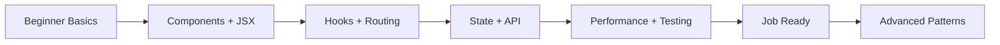

# React Mastery

Friendly, practical React documentation from zero to job-ready.

## What is React and why learn it in 2024?
React is a JavaScript library for building interactive user interfaces with reusable components. It is used in startups, enterprise apps, dashboards, and e-commerce products. Learning React helps you build real products and become employable as a frontend developer.

## Visual roadmap: Beginner -> Job Ready -> Advanced

## Prerequisites
- HTML basics (tags, forms, semantic structure)
- CSS basics (selectors, box model, flex/grid)
- JavaScript basics (variables, functions, arrays, objects, async/await)

## How to use this repo
1. Start from section 01 and follow in order.
2. Copy each code example into a Vite React app.
3. Run, change, and break the code on purpose to learn deeply.
4. Review the quick revision bullets at the end of each file.
5. Practice interview questions after each topic.

## Estimated time per section
- 01 Getting Started: 1-2 days
- 02 Components: 2-3 days
- 03 Hooks: 4-6 days
- 04 Styling: 1-2 days
- 05 Routing: 2 days
- 06 State Management: 3-4 days
- 07 API and Data: 3 days
- 08 Performance: 2 days
- 09 Real Projects: 7-10 days
- 10 Testing: 2-3 days
- 11 Interview Prep: 3-5 days

## Full table of contents
- [01-getting-started/01-what-is-react.md](01-getting-started/01-what-is-react.md)
- [01-getting-started/02-how-react-works.md](01-getting-started/02-how-react-works.md)
- [01-getting-started/03-setup-your-first-project.md](01-getting-started/03-setup-your-first-project.md)
- [01-getting-started/04-jsx-explained.md](01-getting-started/04-jsx-explained.md)
- [02-components/01-what-is-a-component.md](02-components/01-what-is-a-component.md)
- [02-components/02-functional-vs-class-components.md](02-components/02-functional-vs-class-components.md)
- [02-components/03-props.md](02-components/03-props.md)
- [02-components/04-state.md](02-components/04-state.md)
- [02-components/05-component-lifecycle.md](02-components/05-component-lifecycle.md)
- [03-hooks/01-what-are-hooks.md](03-hooks/01-what-are-hooks.md)
- [03-hooks/02-useState.md](03-hooks/02-useState.md)
- [03-hooks/03-useEffect.md](03-hooks/03-useEffect.md)
- [03-hooks/04-useContext.md](03-hooks/04-useContext.md)
- [03-hooks/05-useRef.md](03-hooks/05-useRef.md)
- [03-hooks/06-useMemo-useCallback.md](03-hooks/06-useMemo-useCallback.md)
- [03-hooks/07-useReducer.md](03-hooks/07-useReducer.md)
- [03-hooks/08-custom-hooks.md](03-hooks/08-custom-hooks.md)
- [04-styling/01-css-modules.md](04-styling/01-css-modules.md)
- [04-styling/02-styled-components.md](04-styling/02-styled-components.md)
- [04-styling/03-tailwind-with-react.md](04-styling/03-tailwind-with-react.md)
- [04-styling/04-inline-styles.md](04-styling/04-inline-styles.md)
- [05-routing/01-what-is-routing.md](05-routing/01-what-is-routing.md)
- [05-routing/02-react-router-setup.md](05-routing/02-react-router-setup.md)
- [05-routing/03-dynamic-routes.md](05-routing/03-dynamic-routes.md)
- [05-routing/04-protected-routes.md](05-routing/04-protected-routes.md)
- [05-routing/05-navigation-and-links.md](05-routing/05-navigation-and-links.md)
- [06-state-management/01-why-state-management.md](06-state-management/01-why-state-management.md)
- [06-state-management/02-context-api.md](06-state-management/02-context-api.md)
- [06-state-management/03-redux-toolkit.md](06-state-management/03-redux-toolkit.md)
- [06-state-management/04-zustand.md](06-state-management/04-zustand.md)
- [06-state-management/05-when-to-use-what.md](06-state-management/05-when-to-use-what.md)
- [07-api-and-data/01-fetch-api.md](07-api-and-data/01-fetch-api.md)
- [07-api-and-data/02-axios.md](07-api-and-data/02-axios.md)
- [07-api-and-data/03-react-query.md](07-api-and-data/03-react-query.md)
- [07-api-and-data/04-loading-error-states.md](07-api-and-data/04-loading-error-states.md)
- [07-api-and-data/05-environment-variables.md](07-api-and-data/05-environment-variables.md)
- [08-performance/01-why-performance-matters.md](08-performance/01-why-performance-matters.md)
- [08-performance/02-react-memo.md](08-performance/02-react-memo.md)
- [08-performance/03-lazy-loading.md](08-performance/03-lazy-loading.md)
- [08-performance/04-code-splitting.md](08-performance/04-code-splitting.md)
- [08-performance/05-virtual-dom-explained.md](08-performance/05-virtual-dom-explained.md)
- [09-real-world-projects/01-todo-app.md](09-real-world-projects/01-todo-app.md)
- [09-real-world-projects/02-weather-app.md](09-real-world-projects/02-weather-app.md)
- [09-real-world-projects/03-expense-tracker.md](09-real-world-projects/03-expense-tracker.md)
- [09-real-world-projects/04-ecommerce-product-page.md](09-real-world-projects/04-ecommerce-product-page.md)
- [09-real-world-projects/05-full-auth-flow.md](09-real-world-projects/05-full-auth-flow.md)
- [10-testing/01-why-test.md](10-testing/01-why-test.md)
- [10-testing/02-jest-basics.md](10-testing/02-jest-basics.md)
- [10-testing/03-react-testing-library.md](10-testing/03-react-testing-library.md)
- [10-testing/04-writing-your-first-test.md](10-testing/04-writing-your-first-test.md)
- [11-interview-prep/01-top-50-react-questions.md](11-interview-prep/01-top-50-react-questions.md)
- [11-interview-prep/02-coding-challenges.md](11-interview-prep/02-coding-challenges.md)
- [11-interview-prep/03-common-mistakes.md](11-interview-prep/03-common-mistakes.md)
- [11-interview-prep/04-react-cheatsheet.md](11-interview-prep/04-react-cheatsheet.md)

Great start! We will learn React step by step, together. 🎉
